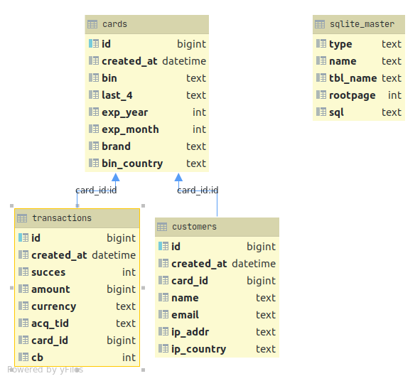

# Chargebacks dataset

## Description

### Context

A chargeback is a return of money to a payer of some transaction, especially a credit card transaction

Most commonly the payer is a consumer. The chargeback reverses a money transfer from the consumer's bank account, line of credit, or credit card. The chargeback is ordered by the bank that issued the consumer's payment card. 

### Content

- chargeback report
- database schema

 